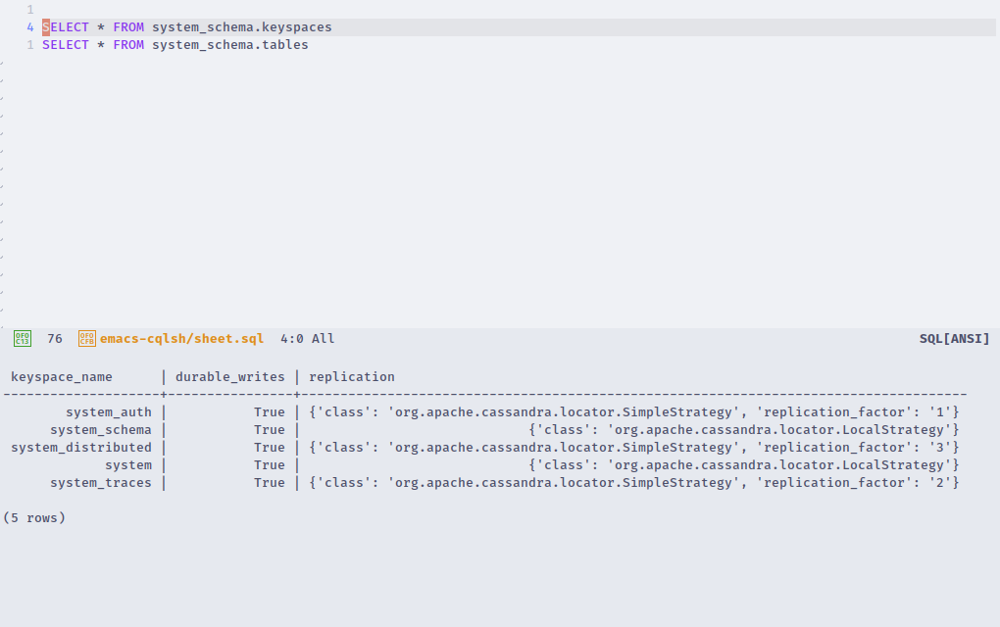

# What is it?

It&rsquo;s a small tool to do query from emacs and get query result in the new buffer.

# Install

1.  Install [cqlsh](https://pypi.org/project/cqlsh/)
2.  Clone repository
    
        git clone https://github.com/Prikaz98/emacs-cqlsh.git

3.  Add load-path into your emacs configuration file and override variables
    
        (add-to-list 'load-path "~/.emacs.d/emacs-cqlsh")
        
        (require 'emacs-cqlsh)
        
        (setq url "localhost")
        (setq port "9042")
        (setq cassandra-name "cassandra")
        (setq cassandra-pass "cassandra")

That is all.

# Optional

if you, as me, don&rsquo;t like to have vertical window split then add:

    (setq split-width-threshold 9999)

# Screenshot

